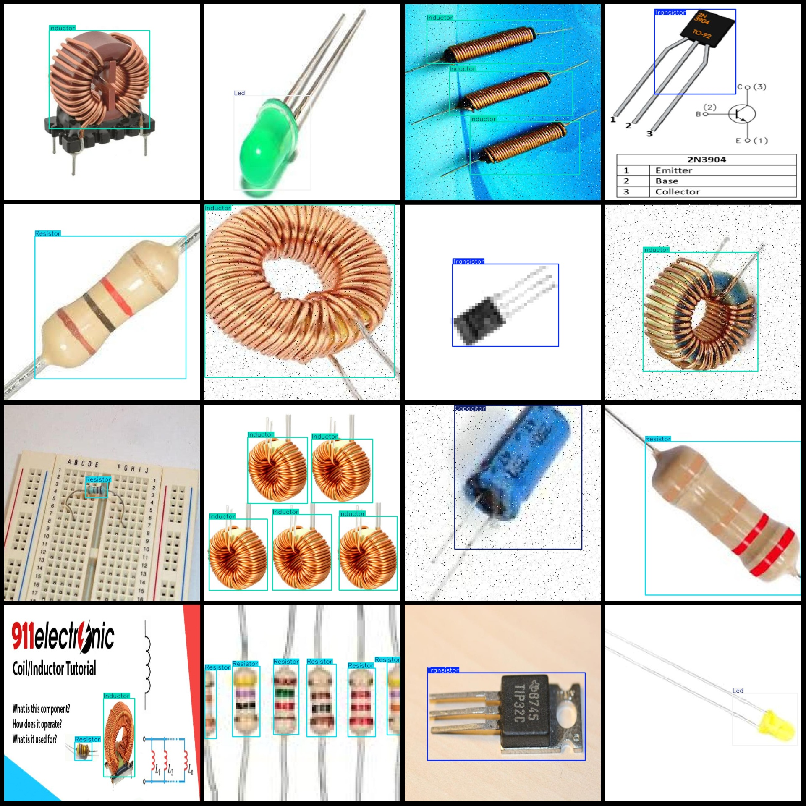

# Electronic Components Detection Dataset: VOC+YOLO (1032 Images, 5 Categories)

Dataset format: Pascal VOC format + YOLO format (txt file without split path, only containing jpg images, corresponding VOC format xml files, and YOLO format txt files).
Total number of images (jpg file count): 1032
Number of annotations (xml file count): 1032
Number of annotations (txt file count): 1032
Number of annotation categories: 5
Annotation category names (note that the order in the YOLO format may not correspond to this, but is based on the labels folder's classes.txt): ["Capacitor", "Inductor", "Led", "Resistor", 
"Transistor"]
Box counts for each category:
- Capacitor (capacitor) box count = 482, occupied images = 116
- Inductor (inductor) box count = 383, occupied images = 211
- Led (led) box count = 389, occupied images = 210
- Resistor (resistor) box count = 460, occupied images = 179
- Transistor (transistor) box count = 380, occupied images = 331
Total box count: 2094
Image resolution: 640x640
Annotation tool used: labelImg
Annotation rules: draw boxes around categories
Important note: The dataset does not have separate training/validation/test sets; they must be manually divided.
Special declaration: This dataset does not guarantee any accuracy of the trained model or weight files.
Image preview:
Annotation example:

## Images

Here is a pay link on Stripe ( https://buy.stripe.com/3cs8yP7sY87d0vu9AB ). Please contact me lonlonago@foxmail.com after funding $89, and I will send you a complete data files , thank you!

